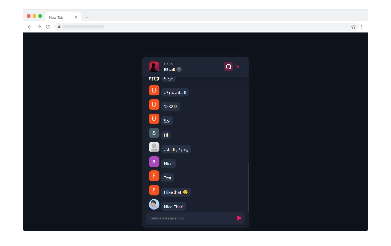

 

  <h3>🦄 Unicorn Chat</h3>

  <a href="https://unicornchat-app.web.app/">View Demo</a>

## About The Project
This is a simple React chat app.

### Features
- 😎 Clean UI
- 🔒 Login Methods:
  - GitHub
  - Google
  - Twitter
- ⚡ Developer privileges
  - The Ability to Delete Messages
  - Admin Panel (soon)

### Built With
- [React](https://github.com/facebook/react)
- [Firebase SDK](https://github.com/firebase/firebase-js-sdk)
- [React Firebase Hooks](https://github.com/CSFrequency/react-firebase-hooks)
- [React Icons](https://react-icons.github.io/react-icons/)
- [Styled Components](https://styled-components.com/)
